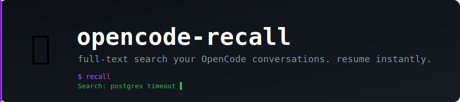

<p align="center">
  
</p>

<p align="center">
  <b>Full-text search your OpenCode conversations. Pick up right where you left off.</b>
</p>

<p align="center">
  
  
  
  
</p>

---

If you use [OpenCode](https://opencode.ai) heavily, you know the problem: you had a great session debugging that tricky issue three days ago, and now you can't find it. `opencode-recall` is a fast terminal UI that lets you search across all your past conversations and jump back into any of them instantly.

No cloud sync. No API calls. It reads your local OpenCode SQLite database directly — read-only, zero risk.

## What it looks like

```
┌─────────────────────────────┬────────────────────────────────────────────┐
│ Search: postgres timeout     │ 2026-04-12 · fix postgres connection pool  │
│                              │                                            │
│ > fix postgres connection... │ You: the app keeps throwing timeout errors │
│   refactor auth middleware   │ on postgres after ~10 min idle...          │
│   add dark mode to dashboard │                                            │
│   debug webpack build        │ Assistant: This is a classic connection    │
│   openapi spec review        │ pool exhaustion issue. The default...      │
│                              │                                            │
│ [Ctrl+E] scope: everywhere   │                    [Enter] resume session  │
└─────────────────────────────┴────────────────────────────────────────────┘
```

## Features

- **Full-text search** — searches session titles and full message content as you type
- **Split-pane TUI** — session list on the left, conversation preview on the right
- **Resume instantly** — press Enter to reopen any session in OpenCode
- **Scope toggle** — search everywhere or limit to sessions from the current directory
- **Debounced search** — stays snappy even with hundreds of sessions
- **Copy session ID** — Ctrl+Y copies to clipboard for scripting

## Install

Requires [uv](https://docs.astral.sh/uv/):

```bash
git clone https://github.com/alvaropma/opencode-recall.git
cd opencode-recall
uv sync
```

Add a shell alias so you can call it from anywhere:

```bash
alias recall='cd /path/to/opencode-recall && uv run python recall.py'
```

Or with the wrapper script installed via `~/.local/bin/recall`:

```bash
recall
```

## Usage

```bash
uv run python recall.py
```

Start typing to search. Results update as you type.

## Keybindings

| Key | Action |
|-----|--------|
| Type anything | Search across all conversations |
| ↑ ↓ | Navigate session list |
| Enter | Resume selected session in OpenCode |
| Ctrl+Y | Copy session ID to clipboard |
| Ctrl+E | Toggle scope (everywhere / current directory) |
| Esc | Quit |

## How it works

OpenCode stores all sessions and messages in a SQLite database at `~/.local/share/opencode/opencode.db`. `recall` opens that database in read-only mode and runs full-text search queries as you type. No data leaves your machine.

## Requirements

- [OpenCode](https://opencode.ai) installed and with at least one session
- Python 3.9+
- [uv](https://docs.astral.sh/uv/) for dependency management

## License

MIT
